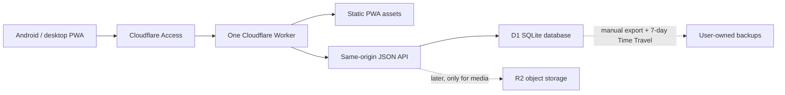

# Daylio clone: product discovery and implementation options

Research snapshot: 29 July 2026. This describes the public Android/iOS product as it exists now, with emphasis on the Android workflow. Daylio changes regularly, so exact screen placement should be verified against the target Android version before UI implementation.

## Short conclusion

This is a small single-user app project. The required workflow is much smaller than Daylio's marketed feature set, and a Cloudflare deployment should comfortably stay at **$0/month** on current free tiers. The only likely unavoidable cost is a domain if Cloudflare Access is used for authentication.

I would not make “full Daylio, but on the web” the MVP. I would make this:

1. An installable, mobile-first PWA.
2. Five mood levels, custom activities and activity groups.
3. One fast end-of-day entry flow, with explicit date selection for yesterday.
4. Daily/selected-weekday and N-times-per-week goals.
5. A minimal timeline for checking and editing recent entries; calendar, search, and statistics follow after the replacement loop works.
6. A server-authoritative Cloudflare D1 database, protected by Cloudflare Access.
7. Validated import of the supplied Daylio history, plus CSV/JSON export for portability.

The MVP can be online-first while caching the app shell and preserving an unsaved entry locally. True offline multi-device synchronization should be a later, explicit phase.

## What Daylio actually is

Daylio is a structured event log with analytics layered on top. Its core loop is deliberately tiny:

1. Choose one mood.
2. Choose zero or more activities/tags, arranged into groups.
3. Optionally add scales, text, templates, photos, or audio.
4. Save the entry at a chosen date and time.
5. Daylio derives timelines, calendars, streaks, goal progress, counts, trends, and activity/mood associations from those entries.

It supports multiple entries in a day, while this clone uses one summary entry per day. That distinction affects statistics: Daylio explicitly notes that its “same day” activity comparison differs from its simple “with/without activity” comparison when a day contains multiple entries.

### Current feature inventory

| Area | How Daylio works today | Relevance to the clone |
|---|---|---|
| Mood capture | Five fixed mood categories form the underlying 5-point scale. Default moods can be renamed/re-emoji'd. Extra custom moods live inside one of those five categories and can be reordered or moved between categories. Custom moods can be archived, replaced/merged, or deleted. | Essential, but the MVP can start with exactly five moods unless source data contains custom mood names. Preserve the numeric tier separately from the display name. |
| Activities | Entries contain any number of user-configurable activity tags, normally shown as grouped icon buttons. Historical activities should be archivable so old entries remain meaningful. | Essential. Activity groups, ordering, and archive state are part of the real product, not cosmetic extras. |
| Entry content | An entry can also have a note title/body, note template, photos, audio/voice memo, and newer custom scales/sliders such as sleep, stress, pain, energy, duration, or a count. Date and time can be edited. | Creating scales, notes, photos, and audio is explicitly out of the MVP. The importer can retain legacy note values so migration remains lossless, but there is no authoring workflow for them yet. |
| Feed and retrieval | Entries appear in a chronological list and calendar. The app supports search and now has an “On This Day” view for entries from the same date in earlier years. | A minimal recent timeline is MVP so entries can be checked and corrected. Calendar, search, and “On This Day” follow later. |
| Goals | A goal is either a challenge or a goal linked to an activity. Schedules include selected weekdays or a required number of completions per week; Daylio also markets daily/weekly/monthly goals. Goals may be checked directly without creating an entry. Selecting a linked activity in an entry also completes the goal. Goals have reminders, start date, archive/delete, ordering, levels, current/longest streaks, success rate, trends, and completion history. | Essential subset: activity-linked goals, selected weekdays/N-per-week, direct check/uncheck, current streak, and simple completion rate. The direct checkbox means goal completion cannot be represented only as an entry/activity join. |
| Basic statistics | Mood line/trend charts; average mood; mood distribution/count; activity frequency; changes versus a previous period; weekday occurrence; calendar and “Year in Pixels”; weekly/monthly/yearly summaries. | Post-MVP. None of these are required before switching daily entry creation away from Daylio. |
| Advanced statistics | Per mood/activity/group drill-down; related activities; longest periods with/without an activity; which activities commonly occur with a mood; and “Influence on Mood” comparisons for with/without, previous day, same day, and next day. Daylio attaches low/medium/high confidence based on available observations. Newer releases add scale history and comparisons against moods, activities, or other scales. | Later phase. Daylio does not publish the exact confidence/formula implementation, so ours should use a documented, transparent calculation rather than pretend to match proprietary numbers exactly. |
| Motivation | Entry streaks, goal streaks, levels, achievements, challenges, important days, reminders, monthly/yearly reports, shareable charts, and an annual wrap-up. | Mostly non-MVP. Streaks may be worth adding early because they are straightforward derived data. |
| Customization/accessibility | Mood emojis, activity icons, colors and themes, dark mode, font size/contrast, language, first day of week, and time format. | Mobile layout, dark mode, timezone, and week start matter. A 2,000-icon library and theme editor do not. |
| Security and portability | Journal content is stored locally in the app's private directory. Android backup uses platform cloud storage; simultaneous multi-device use is explicitly unsupported. Daylio supports PIN/biometric app lock, automatic/manual backup, a proprietary backup file, and PDF/CSV exports. | Our server-backed model improves availability across devices but is less private by default. Export and recoverability are MVP features. |
| Platform integrations | Daylio has some Apple Health integration. Recent public discussion suggests health-derived data is still limited and inconsistent across platforms. | Not relevant to the initial Android/PWA replacement. A PWA cannot reproduce native integrations or Android home-screen widgets cleanly. |

The product's main navigation is effectively **Entries**, **Stats**, and **More/settings**, with calendar/search and goals accessible from those areas. The exact current visual treatment matters much less than preserving the entry speed: mood first, then large grouped activity buttons, then save.

## What is actually in scope

Based on the product requirements, the clone is:

- One summary entry per logical day.
- Exactly one of five overall mood levels.
- Many custom, multi-select activities.
- A few activity-backed goals with daily or weekly schedules.
- A minimal recent-entry list so a saved entry can be checked and corrected.

The MVP excludes creation/editing flows for scales, photos, text, and audio. Historical imports may still preserve legacy records when present, while the corresponding daily entries still import normally. Statistics can follow the core MVP. Custom sub-moods, achievements, challenges, themes, report sharing, PDF export, and health integrations remain non-goals.

There is one useful workflow improvement to Daylio: make **logical entry date** first-class. If the app is opened after midnight, it can show “Log yesterday” prominently instead of silently treating creation time as the day being described.

## Three sensible implementation extents

### Level 1: local-only PWA

- Everything stored in IndexedDB in the browser.
- Installable on Android; works offline.
- Manual encrypted JSON/CSV export and import.
- No account, no server, no recurring cost.

This is the cheapest and simplest application, but browser storage is not a sufficient sole home for long-running journal history. Device/browser clearing and multi-device transfer remain operational concerns.

### Level 2: server-authoritative PWA — chosen MVP

- PWA shell cached on-device.
- D1 is the authoritative data store.
- Same current data is available from every authenticated browser.
- All CRUD is online; an in-progress form is saved locally until submitted.
- Simple optimistic concurrency prevents one tab from silently overwriting another.
- Manual JSON/CSV export plus D1 recovery protects against mistakes.

This provides “use it from any device” without building a synchronization engine. For a one-entry-per-day model, requiring a connection at save time is likely the right MVP tradeoff.

### Level 3: offline-first, real synchronization

- Full local IndexedDB replica on every device.
- Client-generated IDs and an append/change log.
- Cursor-based sync, deletion tombstones, per-record revisions, retry/idempotency, and conflict handling.
- Local reads and writes work indefinitely without a connection.
- Optional end-to-end encryption and device/key enrollment.

This is not merely a more polished Level 2. It is a separate distributed-systems feature. It is worth doing only after the server-backed product has replaced Daylio successfully.

## Recommended Cloudflare architecture

Recommended implementation shape:

- **Frontend:** TypeScript + React + Vite, mobile-first, installable PWA.
- **Backend:** a small TypeScript Worker; Hono is a reasonable router, though plain Worker routing is also enough at this size.
- **Deployment:** one Worker project serving static assets and `/api/*` from the same hostname.
- **Database:** D1 with SQL migrations and prepared queries. An ORM is optional rather than necessary.
- **Authentication:** Cloudflare Access using an administrator-managed identity provider or email OTP, with an allow policy for the approved identity.
- **Media:** no R2 bucket until photos/audio enter the agreed scope.

Using one hostname avoids CORS complexity and makes authentication cookies, the PWA, and the API easier to reason about.

### React versus React Native for Web

Use **regular React for the MVP**, not React Native targeting web.

React Native for Web is viable—it is a compatibility layer that renders React Native-compatible code through React DOM—but it makes the web implementation adopt React Native's component and styling constraints now in exchange for possible UI reuse later. Native is only a possibility here, while the PWA, browser file import, responsive web UI, and Cloudflare deployment are definite requirements.

React also does not trap us on the web. Structure the code so that pure TypeScript domain rules, validation, API types, and the API client contain no DOM dependencies. A later Expo app can reuse those packages and the entire Worker/D1 backend; only the presentation layer needs to be native. If a store-distributed native app becomes a near-term requirement before implementation starts, revisit Expo then. Otherwise React + Vite is the smaller and more direct choice.

Expo's own current documentation supports PWAs but warns that service-worker caching can create update problems and recommends native for the best offline mobile experience. That reinforces the scope boundary: the chosen server-authoritative MVP uses a modest PWA shell cache and local draft recovery, not an ambitious offline replica.

### Icon set

Use **Material Symbols Rounded** as the initial activity icon set. Google publishes more than 2,500 symbols under Apache 2.0, with web, Android, and iOS assets. It can be self-hosted as a variable font, so the activity picker remains private and available with the cached PWA shell.

Store the stable symbol name—not SVG markup or a font codepoint—in each activity row. Build a searchable picker over names/categories and render a neutral fallback if an icon is ever removed. The supplied CSV does not contain Daylio's icon assignments, so exact icon fidelity cannot be reconstructed from it. For imported activities, seed sensible keyword-based suggestions and provide a batch review screen rather than forcing manual choices before import.

### Authentication recommendation

For a sole-user app, do not build registration, password reset, email delivery, sessions, or a user-management UI. Put Cloudflare Access in front of the entire hostname and allow only the approved identity. Cloudflare's free Zero Trust plan supports up to 50 users, so this is comfortably in scope.

The Worker should still validate the Access assertion and enforce the expected identity for API routes. That protects against an accidental broad Access policy. Use a long session duration so the installed PWA does not feel like it has a login screen every day.

Tradeoffs:

- Access on a custom hostname requires a domain managed through or configured with Cloudflare.
- Email OTP is easy but adds inbox friction. Cloudflare-account login with MFA is better if you already administer the Cloudflare account.
- If there is no domain and absolute zero cost is a hard requirement, the project can put a small single-user password/passkey layer on a `workers.dev` app, but that shifts security-sensitive auth code into this project. The domain + Access route remains preferable.

### Privacy model

Daylio's strongest property is that journal content never goes to Daylio's servers. A normal D1 implementation does not preserve that property: the application backend can read the records. Access prevents unauthorized users from reaching the app, but it is not end-to-end encryption.

There are three possible privacy levels:

1. **Normal server storage:** TLS in transit, Access at the edge, D1 readable by the app/operator. Recommended MVP.
2. **Encrypt sensitive fields before D1:** workable, but server-side search and stats become limited or require downloading/decrypting data in the browser.
3. **End-to-end encrypted local replicas:** strongest privacy, but key recovery, new-device enrollment, offline sync, and conflict resolution become core product features.

For a project in its own Cloudflare account, level 1 is a reasonable starting point as long as the distinction is explicit.

## Data model

The important modeling decision is to preserve stable IDs and archive records instead of deleting meanings out from under historical entries.

| Table | Important fields | Why it exists |
|---|---|---|
| `mood_levels` | `id`, `score` (1–5), `name`, `icon`, `color`, `sort_order` | Keeps the analytic score stable while allowing display customization. |
| `moods` (optional initially) | `id`, `level_id`, `name`, `icon`, `sort_order`, `archived_at` | Supports Daylio-style custom moods within the five fixed categories. |
| `activity_groups` | `id`, `name`, `sort_order`, `archived_at` | Drives the grouped button layout. |
| `activities` | `id`, `group_id`, `name`, `icon`, `sort_order`, `archived_at` | User-defined tags. Archive rather than destroy. |
| `entries` | UUID `id`, `logical_date`, `occurred_at`, `timezone`, `mood_id`, nullable import-only legacy note fields, `version`, timestamps, `deleted_at` | `logical_date` is deliberately distinct from creation time. `version` supports safe updates/sync. Legacy note columns preserve the three existing values without adding note authoring to the MVP. |
| `entry_activities` | `entry_id`, `activity_id` | Many-to-many selection. |
| `goals` | `id`, `activity_id`, schedule type/config, `start_date`, reminder config, ordering, archive state | A goal is normally linked to an activity but has its own schedule and lifecycle. |
| `goal_completions` | `goal_id`, `logical_date`, optional `entry_id`, timestamps | Needed because a goal can be checked without an entry. Unique on goal/date prevents duplicates. |

Do not store goal streaks, mood averages, or activity correlations as mutable truth in the first version. Derive them from entries/completions. At MVP data sizes those calculations are inexpensive, and derived values cannot drift out of sync.

## Post-MVP statistics backlog

1. Entry consistency: days logged, current/longest streak, missing days.
2. Mood line by day/week/month with a transparent 1–5 score.
3. Mood distribution and average for a selected period.
4. Activity frequency and trend versus the prior equal-length period.
5. Activity × mood table: occurrence count and average mood with/without each activity.
6. Goal completion rate, current streak, and longest streak according to each goal's schedule.
7. Calendar and Year in Pixels.

Later, add previous-day/same-day/next-day associations and confidence. These should be labeled **association**, not causation. We can publish the exact formula and minimum sample thresholds. That is more trustworthy than attempting to reverse-engineer Daylio's undisclosed calculation.

## Importing historical Daylio data

Migration is a **non-negotiable launch requirement**, not a post-launch convenience. The app is not a viable Daylio replacement until it has imported and validated the supplied multi-year dataset.

Before changing or uninstalling anything, export both:

1. **CSV export** — normally contains date/time, mood, pipe-separated activities, note title, and note; newer exports can add a scales column.
2. **Manual `.daylio` backup** — contains entries, moods, activities, settings, and potentially media/metadata that CSV loses.

### Supplied CSV profile

The source CSV was parsed without printing any note contents. It is retained as an independent audit source for date/time, mood, activity selections, and legacy text fields; raw counts, date ranges, and note statistics are intentionally omitted from this repository.

This is enough to define and test historical entry support: one logical date/time, one standard mood, and a many-to-many set of arbitrary configurable activities. The breadth of activity names confirms that the model must not impose a fixed taxonomy.

It is **not** exhaustive for recreating the current app setup. CSV does not tell us:

- Activity groups, group order, activity order, or chosen icons.
- Goal identities, schedules, start dates, reminder settings, or archive state.
- Activities/configuration that exist in Daylio but never appear in an exported entry.
- Mood icons/colors or other display settings.

### Supplied manual backup profile

The source Android v15-format backup at `../private/backup.daylio` is a ZIP containing a Base64-encoded JSON payload and JPEG assets. The files remain outside this repository. A read-only parse and reconciliation against the CSV established:

- Source records can be reconciled against the CSV on logical date, time, mood, and activity selections.
- Moods, activities, and activity groups include icon, group/order, and state metadata; IDs must remain authoritative even when display names repeat.
- The backup may contain unused or historical activities that do not appear in the CSV; the importer should retain them when required for reconciliation.
- Goal definitions and goal-history rows are present; the importer should preserve raw state until the semantic mapping is covered by fixtures.
- Day entries store months zero-based, while goal-history rows store months one-based. The importer must use collection-specific date decoders.
- The backup may include JPEG assets. Photo import is intentionally optional for the MVP.
- The backup may include scales, notes, favorites, preferences, reminders, writing templates, achievements, and milestones; the importer should preserve only the fields required by the product scope.

This backup is authoritative for migration. No settings screenshots are needed for data-model discovery. The CSV remains a valuable independent audit source, but is not sufficient by itself because it flattens activity groups and goals and omits icons, settings, templates, and attachments.

The importer must:

- Parse locale/date/time carefully and retain the original source row.
- Generate deterministic IDs so retrying an import is idempotent.
- Create the distinct mood/activity catalog found in the file.
- Preserve mood categories, activity groups, archive state, goal definitions/completions, and legacy note values whenever they exist in the source backup.
- Detect duplicates and show counts before writing.
- Import into a staging database first and compare totals by year, mood, and activity.
- Record an import manifest containing source-file hashes, Daylio/app format version if detectable, source counts, imported counts, skips, and errors.
- Fail safely on unknown records rather than silently dropping data.

The source CSV and `.daylio` files remain untouched. Public reverse-engineering can guide the format investigation, but the proprietary format is not a stable contract, so the supplied export is the authoritative compatibility fixture.

### Migration acceptance criteria

- The same total entry count as Daylio, including multiple entries on one day.
- Counts by year, mood, and activity match the source export.
- Every source record is accounted for as imported, deliberately unsupported with an explicit reason, or invalid with an explicit error; silent loss is forbidden.
- Original dates, times, logical days, mood meanings, activity membership, and note text round-trip correctly.
- Configuration records found in the backup are either imported or called out before launch.
- Re-importing the same files produces no duplicates or changes.
- A rollback/export is created before promoting staged data into the production database.
- Automated importer tests include a sanitized copy or structurally equivalent fixture derived from the source export format, not only hand-written sample CSV.

## Backups and escape hatch

The app should always provide:

- Download all data as versioned JSON.
- Download a Daylio-like CSV for spreadsheet analysis.
- A documented restore path.
- A pre-migration/staging validation report.

D1's free plan includes automatic **7-day Time Travel**, which is useful for operational mistakes but is not a long-term archive. Periodic independent exports should eventually be copied to durable storage. Cloudflare documents automatic D1 export to R2 as a later option; a manual export is enough for the MVP.

## Current free-tier fit

For one person, the load is microscopic compared with current Cloudflare allowances:

| Service | Current free allowance | Expected use here |
|---|---|---|
| Worker API | 100,000 requests/day; 10 ms CPU per invocation | Likely tens of requests on an active day. Static assets are free/unlimited when served as Worker static assets. |
| D1 | 5 million rows read/day, 100,000 rows written/day, 5 GB total storage | Historic entries plus small join tables. Indexed date-range queries remain far below the allowance. |
| R2, if later needed | 10 GB-month storage, 1M Class A and 10M Class B operations/month | Plenty for occasional photos/audio, but not needed for the MVP scope. |
| Cloudflare Access | $0 forever for up to 50 users | One approved identity. |

Likely steady-state cost: **$0/month**, plus domain registration if needed. Free tiers are account-wide, not dedicated to this one app, and Cloudflare can change product terms, so the deployment should include usage alerts and portable exports.

For Vietnam, create the D1 database with the `apac` location hint. Cloudflare says the hint is advisory, not a guarantee.

## Proposed delivery slices

### Slice 0 — migration proof

- The supplied CSV has been profiled completely without exposing note contents.
- Identify the exact `.daylio` container/schema emitted by the target Android version.
- Build a local, read-only import dry run for both the backup and CSV audit source.
- Produce an import manifest and verify totals by year, mood, activity, and goals against Daylio.
- Resolve every unsupported record type before any production import.

This should happen before UI work because the existing history determines the real schema.

### Slice 1 — replacement loop

- Deploy/auth shell.
- Configure five moods, activity groups, and activities.
- Configure the small set of active goals and allow direct daily completion.
- Create/edit/delete one entry, including today/yesterday selection.
- Show a minimal recent-entry timeline for verification and corrections.
- Import the validated history.
- JSON/CSV export.

Success criterion: the replacement workflow supports daily use without losing speed or trust.

### Slice 2 — retrieval and basic statistics

- Calendar and search.
- Streaks and completion rates.
- Mood trend/distribution.
- Activity frequency and with/without association.
- Year in Pixels and search.

Success criterion: the historical views required by the product have credible equivalents.

### Slice 3 — resilience and polish

- Installability/offline app shell, local unsaved-draft recovery.
- Better backup automation.
- Accessibility, dark mode, responsive desktop layout.
- Performance checks across the full four-year dataset.

### Slice 4 — only if proved necessary

- Full offline database and synchronization protocol.
- Notes/templates, photos/audio, scales, reminders/push.
- End-to-end encryption and key recovery.
- Advanced correlations, reports, achievements, On This Day, sharing.

## Open implementation decisions

The answers to these determine the concrete MVP:

1. Which `.daylio` backup variant must the importer support for activity groups, icons, and goal configuration?
2. Which Cloudflare domain and identity-provider sign-in method should deployment use?
3. Are goals always tied to activities, and which schedules must be supported: fixed weekdays, N times/week, or monthly?
4. Should legacy note values be preserved during import even though note authoring is out of scope?

The most useful next artifact is a sanitized or locally available `.daylio` backup. If that is unavailable, screenshots of activity groups and active-goal settings are the fallback. Private exports should be processed locally, with reports containing aggregates rather than raw journal text.

## Sources

Primary/current product sources:

- [Daylio official product overview](https://daylio.net/)
- [Google Play listing, current Android feature list and data-safety disclosure](https://play.google.com/store/apps/details?id=net.daylio)
- [Daylio FAQ index](https://daylio.net/faq/)
- [Create and manage moods](https://daylio.net/faq/docs/daylio-faq/tutorials/create-and-manage-moods/)
- [Set up and track goals](https://daylio.net/faq/docs/daylio-faq/tutorials/setting-up-goals/)
- [Activity and mood statistics](https://daylio.net/faq/docs/daylio-faq/about/activity-and-mood-statistics/)
- [Daylio premium feature inventory](https://daylio.net/faq/docs/daylio-faq/about/daylio-premium-features/)
- [Multiple-device limitation](https://daylio.net/faq/can-i-use-daylio-on-multiple-devices/)
- [Backup options](https://daylio.net/faq/docs/daylio-faq/backup/backup-options/)
- [Data security](https://daylio.net/faq/docs/daylio-faq/about/how-secure-is-my-data/)
- [App Store version history for recent Scales and On This Day changes](https://apps.apple.com/us/app/daylio-journal-mood-tracker/id1194023242)

Cloudflare sources, checked 29 July 2026:

- [Workers pricing](https://developers.cloudflare.com/workers/platform/pricing/)
- [Worker static asset billing](https://developers.cloudflare.com/workers/static-assets/billing-and-limitations/)
- [D1 pricing](https://developers.cloudflare.com/d1/platform/pricing/)
- [D1 Time Travel and backups](https://developers.cloudflare.com/d1/reference/time-travel/)
- [D1 import/export](https://developers.cloudflare.com/d1/best-practices/import-export-data/)
- [D1 data location](https://developers.cloudflare.com/d1/configuration/data-location/)
- [Cloudflare Zero Trust pricing](https://www.cloudflare.com/plans/zero-trust-services/)
- [Cloudflare Access identity providers](https://developers.cloudflare.com/cloudflare-one/integrations/identity-providers/)
- [Cloudflare Access one-time PIN](https://developers.cloudflare.com/cloudflare-one/integrations/identity-providers/one-time-pin/)
- [Google Material Symbols guide and license](https://developers.google.com/fonts/docs/material_symbols)
- [React Native for Web overview](https://necolas.github.io/react-native-web/docs/)
- [Expo web development](https://docs.expo.dev/workflow/web/)
- [Expo PWA guidance](https://docs.expo.dev/guides/progressive-web-apps/)

Secondary migration reference used only to understand the CSV shape:

- [Community documentation of Daylio CSV columns](https://michaelcurrin.github.io/daylio-csv-parser/csv-format.html)

## Legal/design note

Clone the behavior and the app's data model, not Daylio's name, logo, proprietary icons, illustrations, or pixel-for-pixel visual design. A distinct name and visual system also gives freedom to optimize the app around a one-entry-per-day workflow.
